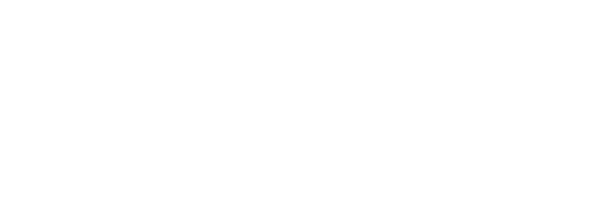

# THINGS TO EAT OR GET EATEN BY
  

  

## 1. Fatclaw
Big claws. Run fast. Snap bones. Taste incredible!  
2 STR, 6 DEX, 2 HP  
d6 Claws

## 2. Bigmouth
Big jump. Big hungry mouth. Skin like mud. Taste bad!  
4 STR, 7 DEX, 4 HP  
d6 Tongue Snap

## 3. Bigsnout
Charge hard. Tear with teeth. Taste very good!  
6 STR, 4 DEX, 4 HP  
d8 Tusks

## 4. Rockback
Big hard shell. Stomp strong. Taste bloody amazing!  
8 STR, 1 DEX, 3 HP  
d8 Crush

## 5. Rival
Ugly! Sharp rocks. Fight for food. Bad manners.  
10 STR, 10 DEX, 3 HP  
d6 Club

## 6. Man-Eater
Bad! Red teeth. Eats own kind. Laugh when hit.  
10 STR, 8 DEX, 6 HP  
d4 Bite

## 7. Clubtail
Hard shell. Heavy body. Smash with tail. Break bones!  
12 STR, 5 DEX, 8 HP  
d10 Tail Smash

## 8. Gorejaw
Big tooth. Big mouth. Stomp ground. Eat everything.  
14 STR, 9 DEX, 14 HP  
d10 Bite

## 9. Skymaw
Big bad bird. Fall from sky. Grab with claws.  
12 STR, 14 DEX, 16 HP  
d10 Talons

## 10. Tuskwalker
Big fur beast. Tusk long. Walk slow. Crush everything. Fat!  
18 STR, 8 DEX, 20 HP  
d10 Trample, d12 Tusks
  

# FRIENDLY THINGS
Some beasts not mean. Some eat grass. Slow and dumb, but kind. If you feed them, they follow. If you ride them, they carry you far.
## Bigslow
Big like hill. Neck like tree. Skin gray. Walk slow. Eat leaf all day.
## Buzzdeer
Tall. Jump good. Stupid. Run fast. Scared of wind! Scared of ant! Taste good.
## Tree-grabber
Funny man with tail. Likes fruit and honey. If you feed, it help. Not smart like man, mess up easy if not show good.

### Making Friends 101
Living things that do not wish to eat you respond to kindness, care, or displays of strength. Alternatively you can simply just abduct them young so they imprint on you!
*	A thing is considered trained once they've eaten 6 rations given by a human.
*	Trained things obey as long as they feel safe and loved.
*	Untrained things obey if you roll under the total number of rations fed to them on a d6
  

# OTHER BEASTS?
This list is too short, why!? Because a few varied statblocks trumps bloat. Missing your favorite dino? Need a triceratops? That’s just a smaller Gorejaw. Want a sabretooth? Use a Bonehorn. Need a pack of Velociraptors? Scale the numbers, not the stats. Your players won’t notice the label, only the danger. Improvise and replace.
  

# WHERE'S THE MAGIC?
This isn’t a fantastical world. No dragons or wizards. But big teeth and cunning can make a beast feel legendary. An elder Skymaw perched on a cliff or a hulking flesh-eating ape hiding in a dark cave can easily take the place of a mythical beast. Besides, fire is magical and mythical enough.
